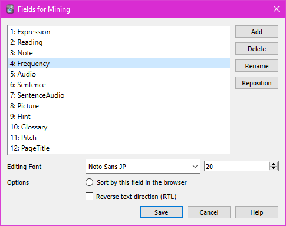
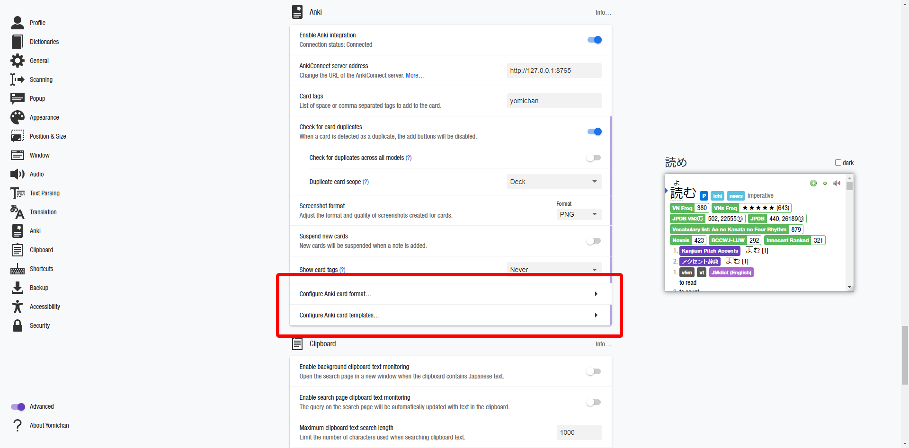
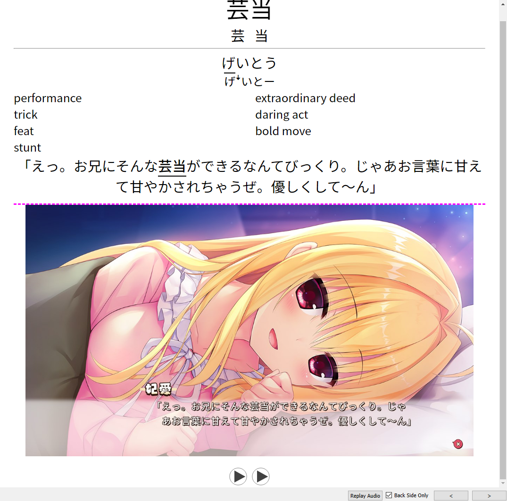
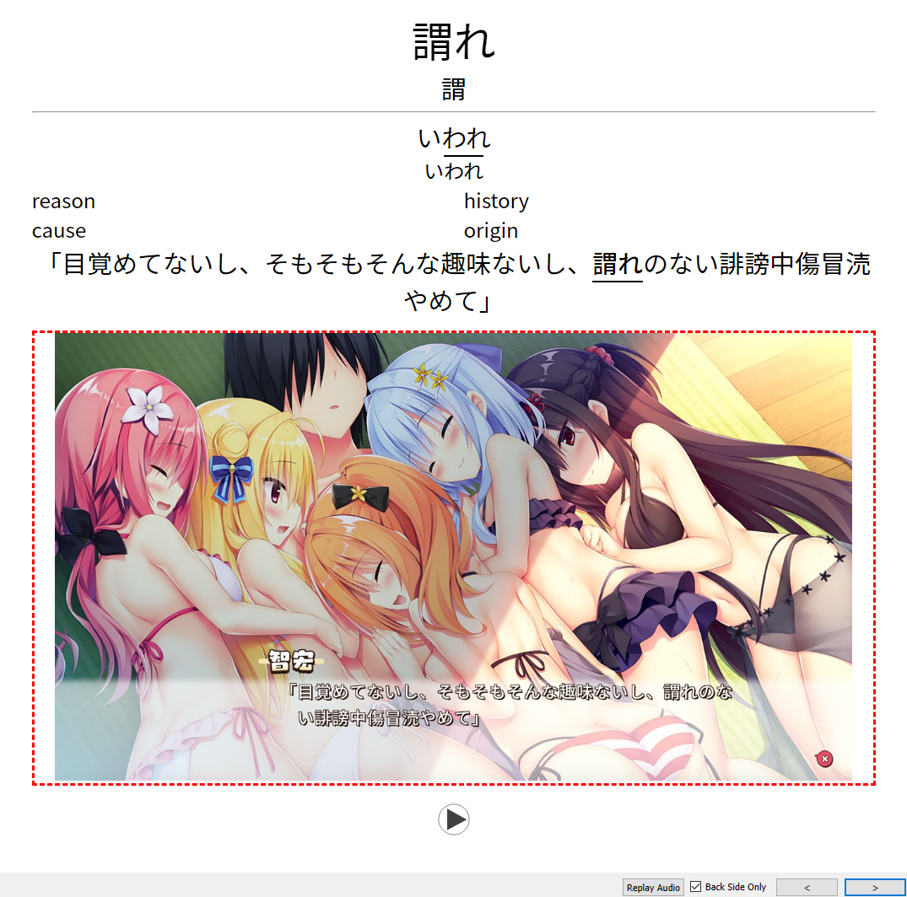
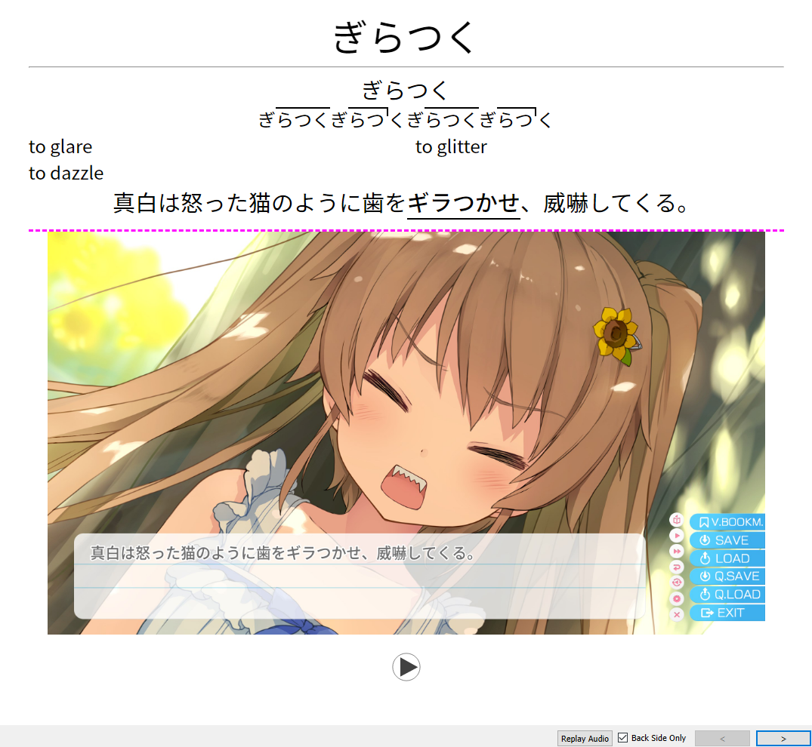

# JP Resources <!-- omit in toc -->

### Check out these [Yomichan dictionaries](https://github.com/MarvNC/yomichan-dictionaries/)

My contributions to the Japanese learning community. For questions and support, please make a thread in the questions forum [in TheMoeWay](https://learnjapanese.moe/join/). For suggestions please mention @Marv.

- [Other Resources](#other-resources)
    - [Dictionaries](#dictionaries)
  - [Special Thanks](#special-thanks)
- [Sorting Mined Anki Cards by Frequency](#sorting-mined-anki-cards-by-frequency)
  - [How-To](#how-to)
  - [Usage](#usage)
  - [Backfilling Old Cards](#backfilling-old-cards)
- [Anki Card Blur](#anki-card-blur)
  - [How-To](#how-to-1)
  - [Usage](#usage-1)
    - [Default to Enabled/Disabled](#default-to-enableddisabled)
  - [Non Persistent/NoJS Version](#non-persistentnojs-version)
  - [ShareX Hotkey for NSFW cards](#sharex-hotkey-for-nsfw-cards)
- [Anki Automatically Highlight in Sentence](#anki-automatically-highlight-in-sentence)
- [Anki Automatic Hint Sentence for Kana Cards](#anki-automatic-hint-sentence-for-kana-cards)
- [Yomichan Text Replacement Patterns](#yomichan-text-replacement-patterns)

## Other Resources

- [JP resources by Aquafina water bottle](https://aquafina-water-bottle.github.io/jp-mining-note/jpresources/) and a [very promising Anki note template](https://aquafina-water-bottle.github.io/jp-mining-note/).
- [arujisho](https://github.com/emc2314/arujisho) - the BEST android dictionary.

#### Dictionaries

These are absolutely essential.

- [Grammar Dictionaries](https://github.com/aiko-tanaka/Grammar-Dictionaries)
- [JMDict Surface Forms](https://github.com/FooSoft/yomichan/issues/2183)
- [Much less bloated JMnedict](https://github.com/FooSoft/yomichan/issues/2111#issuecomment-1192238540)

### Special Thanks

Much thanks to Renji-xD for rewriting the handlebar to find a minimum value. Thanks to KamWithK for developing cool Anki addons to use with this guide. Thanks to GrumpyThomas, pj, and aka_baka for some suggestions.

## Sorting Mined Anki Cards by Frequency

When reading and adding cards from the content you're reading, you'll come across a variety of words with varying degrees of usefulness. Especially as a beginner, you'll want to learn the useful words as soon as possible and learn the less useful words later. With this we can sort a backlog of mined cards by frequency using various installed Yomichan frequency lists.

This handlebar for Yomichan will add a `{freq}` field that will send the lowest frequency value available to Anki in a numerical format.

### How-To

- First, in your Anki card template create a new field for frequency, we can name this `Frequency` or whatever you like.



- Then in Yomichan options, insert the following handlebar code at the end of the menu in `Configure Anki card templates...`.



```handlebars
{{#*inline "freq"}}
    {{~#scope~}}
        {{~#set "min-freq" 0}}{{/set~}}
            {{#each definition.frequencies}}
                {{~#if (op "||" (op "===" (get "min-freq") 0) (op ">" (op "+" (get "min-freq")) (op "+" (regexMatch "\d" "g" this.frequency))))}}
                    {{~#set "min-freq" (op "+" (regexMatch "\d" "g" this.frequency))}}{{/set~}}
                {{~/if~}}
            {{/each}}
        {{get "min-freq"}}
    {{~/scope~}}
{{/inline}}
```

<details>
  <summary>Alternative handlebar</summary>
  The original handlebar I made only selects the first frequency available, which may be useful for some.

```handlebars
{{#*inline "freq"}}
    {{~#if (op ">" definition.frequencies.length 0)~}}
        {{#regexReplace "[^\d]" ""}}
            {{definition.frequencies.[0].frequency}}
        {{/regexReplace}}
    {{~/if~}}
{{/inline}}
```

</details>

- In `Configure Anki card format...`, we may need to refresh the card model for the new field to show up.
  - To do this, change the model to something else and change it back.
  - ⚠️**This will clear your fields, so take a screenshot to remember what you had.**
    - You can try duplicating your card model in Anki and switching to/from that model, so hopefully your card fields will remain.
- When your frequency field shows up, add `{freq}` in its value box to use the handlebar.


### Usage

Use the [AnkiAutoReorder](https://ankiweb.net/shared/info/757527607) addon to have your backlog sort automatically on refresh.

- Enter your search query (`search_to_sort`) and your `sort_field` into the addon's config (`Tools > Addons > AutoReorder > Config`).
  - You can get the appropriate search query by going to the Browse window, then ctrl click your deck name and the "New" card state. The string at the top is the search query you can use in the addon settings, it should have the deck name and `is:new`.
- Then reorder your deck by frequency from `Tools > Reposition Cards`. Remember to do this every day after adding new cards.

_2022-10-21_20-48-50.png>)

I also recommend installing the [Advanced Browser](https://ankiweb.net/shared/info/874215009) addon to display the frequency field in Anki's browse page.

Below: right click the column headers at the top with Advanced Browser installed to select new fields to be displayed.

_2022-07-10_10-22-41.png>)

Alternatively, after installing Advanced Browser, you could sort by the frequency field and press `ctrl + a` then `ctrl + shift + s` to select all cards and reorder.

### Backfilling Old Cards

If you already have a large backlog of old cards without frequency values, you might need to fill in these values first or they won't be sorted. You could just opt to finish reviewing these cards first, but there is a hacky method to backfill these cards. **Make sure to backup your collection before attempting this, it could cause significant lag to your Anki.** In addition, for users of Anki 2.1.50+ [increase your backup interval](https://docs.ankiweb.net/backups.html?highlight=backup#anki-2150) before attempting the import as it will take a _long_ time. A backup occurring while you're waiting on Anki to delete cards will just cause more lag.

- Create a frequency list in `.txt` format that contains a list of expressions followed by frequency values. You can use the ones I have created [here](frequency), I recommend downloading the [JPDB](frequency/JPDB.txt) list as it's the most exhaustive. However the [VN Stars](frequency/vnsfreqSTARS.txt) list also fills in some of the gaps that JPDB doesn't cover, so you could import it first, then import JPDB afterward for maximum frequency coverage.

- In Anki, create a new temporary deck and move your backlogged cards to the new deck, then tag them for later.

  - Search for the backlogged new cards using `deck:{deckname} is:new` in your card browser, then hit `ctrl + a` to select them all then `ctrl + d` to bring up the "Change Deck" menu from which you can create a new deck (named `temp` or whatever you like) and move them.
  - Select this new deck, then tag them using `ctrl + a` then `ctrl + shift + a` to add a new tag, where you can type in something like `backlog`.

- With this temporary deck selected, go to File -> Import, then select the txt frequency list. Map the first field to your term/expression field, then the second field to your frequency field. **Make sure to enable "Update existing notes when first field matches."** Then import it to your temporary deck.


- This will update your existing notes' frequency values, but it'll also import a LOT of new unneeded cards.

  - Search for your backlogged cards using `tag:backlog` and then again hit `ctrl + a` then `ctrl + d` to move them back to your vocabulary deck. Now we can simply delete the temporary deck along with the all the new cards that were added, just **make sure** you aren't deleting any actual cards first.

- Finally, you can right click the `backlog` tag in the sidebar and delete it.

## Anki Card Blur

When adding cards from VNs, we might find some risque content that we still want to look at while reviewing because it's cute. However, you might review in places where you don't always want other people to see your cards. Using this card template, we can blur media in Anki and have the option persist throughout a review session.

|  x   | Blur disabled                                    | Blur enabled                                     |
| :--: | ------------------------------------------------ | ------------------------------------------------ |
| SFW  |  |  |
| NSFW |  |  |

Media: ハミダシクリエイティブ © まどそふと

### How-To

- Decide on a tag for NSFW cards. I use `-NSFW` so the tag is sorted first for easy access. If you choose something else you'll need to replace all instances of `-NSFW` in this guide with your tag name (with `ctrl + h` in a text editor or an [online tool](http://www.unit-conversion.info/texttools/replace-text/)).

- Tag your NSFW cards with this tag in Anki (see [ShareX Hotkey](#sharex-hotkey-for-nsfw-cards)).

- Download the anki-persistence script (`minified.js` or `script.js`) from [here](https://github.com/SimonLammer/anki-persistence/releases/tag/v1.0.0). Then rename it `__persistence.js` and place it in your Anki [user/media folder](https://docs.ankiweb.net/files.html#file-locations).

#### Card Template/Code <!-- omit in toc -->

- In your card template where you want the image to go, paste in this HTML, renaming `{{Picture}}` to match the name of the field that contains your media.

```html
<div id="main_image" class="{{Tags}}">
  <a onclick="toggleNsfw()">{{Picture}}</a>
</div>
```

- Then, at the end of the template paste in this code:

```html
<script src="__persistence.js"></script>

<script>
  // nsfw https://github.com/MarvNC/JP-Resources
  (function () {
    const nsfwDefaultPC = true;
    const nsfwDefaultMobile = false;
    const imageDiv = document.getElementById('main_image');
    const image = imageDiv.querySelector('a img');
    if (!image) {
      imageDiv.parentNode.removeChild(imageDiv);
    }
    let loaded = false;
    setInterval(() => {
      if (!loaded) {
        if (typeof Persistence === 'undefined') {
          return;
        }
        loaded = true;

        let onMobile = document.documentElement.classList.contains('mobile');
        let nsfwAllowed = onMobile ? nsfwDefaultMobile : nsfwDefaultPC;
        if (Persistence.isAvailable() && Persistence.getItem('nsfwAllowed') == null) {
          Persistence.setItem('nsfwAllowed', nsfwAllowed);
        } else if (Persistence.isAvailable()) {
          nsfwAllowed = Persistence.getItem('nsfwAllowed');
        }
        setImageStyle(nsfwAllowed);
      }
    }, 50);
  })();

  function toggleNsfw() {
    if (Persistence.isAvailable()) {
      let nsfwAllowed = !!Persistence.getItem('nsfwAllowed');
      nsfwAllowed = !nsfwAllowed;
      Persistence.setItem('nsfwAllowed', nsfwAllowed);
      setImageStyle(nsfwAllowed);
    } else {
      setImageStyle(undefined, true);
    }
  }

  function setImageStyle(nsfwAllowed = undefined, toggle = false) {
    const imageDiv = document.getElementById('main_image');
    const image = imageDiv.querySelector('img');

    if (nsfwAllowed != undefined) {
      imageDiv.classList.toggle('nsfwAllowed', nsfwAllowed);
    } else if (toggle) {
      imageDiv.classList.toggle('nsfwAllowed');
    }
  }
</script>
```

#### CSS <!-- omit in toc -->

Then in your card styling paste in the following css, making sure to replace `-NSFW` with your tag name.

```css
#main_image.nsfwAllowed {
  border-top: 2.5px dashed fuchsia !important;
}
#main_image {
  border-top: 2.5px solid springgreen;
}
#main_image img {
  cursor: pointer;
}
#main_image.-NSFW {
  border-left: 2.5px dashed red;
  border-right: 2.5px dashed red;
  border-bottom: 2.5px dashed red;
}
#main_image.nsfwAllowed.-NSFW {
  border-top: 2.5px dashed red !important;
}
#main_image.-NSFW img {
  filter: blur(30px);
}
#main_image.nsfwAllowed img {
  filter: blur(0px) !important;
}
```

### Usage

During a review session, you can click/tap the image to toggle card blurring. When the blurring is enabled, there will be a solid green line at the top of the image. When blurring is not enabled, there will be a fuchsia dotted line, and when the card is NSFW the borders will be dotted red. This option will persist throughout a review session but the setting will reset after exiting the session.

#### Default to Enabled/Disabled

In the code we pasted in the template there are variables that can change whether blurring is enabled by default on desktop/mobile separately; the thought being that this script is primarily intended for reviewing on a phone. These variables can be changed with `true` marking that cards will not be blurred by default.

```js
const nsfwDefaultPC = true;
const nsfwDefaultMobile = false;
```

### Non Persistent/NoJS Version

If you want all cards to be blurred by default and for it to stay that way, you can simply do something like this instead. The `.mobile` part can be removed so it works on desktop as well.

#### HTML <!-- omit in toc -->

```html
<div class="main_image {{Tags}}">{{Picture}}</div>
```

#### CSS <!-- omit in toc -->

```css
.mobile .-NSFW img {
  filter: blur(30px);
}

.mobile .-NSFW img:hover {
  filter: blur(0px);
}
```

### ShareX Hotkey for NSFW cards

I use the hotkeys in [this guide](https://rentry.co/mining#hotkey-for-screenshot) (highly recommended) for adding images/audio to new cards while reading. For the screenshot hotkey, I have a hotkey in addition to the normal one that adds a `-NSFW` tag to the new card for convenience so they don't have to be tagged manually after creation. In the argument part of step 8, just use this code instead:

```powershell
-NoProfile -Command "$medianame = \"%input\" | Split-Path -leaf; $data = Invoke-RestMethod -Uri http://127.0.0.1:8765 -Method Post -ContentType 'application/json; charset=UTF-8' -Body '{\"action\": \"findNotes\", \"version\": 6, \"params\": {\"query\":\"added:1\"}}'; $sortedlist = $data.result | Sort-Object -Descending {[Long]$_}; $noteid = $sortedlist[0]; Invoke-RestMethod -Uri http://127.0.0.1:8765 -Method Post -ContentType 'application/json; charset=UTF-8' -Body \"{`\"action`\": `\"updateNoteFields`\", `\"version`\": 6, `\"params`\": {`\"note`\":{`\"id`\":$noteid, `\"fields`\":{`\"Picture`\":`\"`\"}}}}\"; " Invoke-RestMethod -Uri http://127.0.0.1:8765 -Method Post -ContentType 'application/json; charset=UTF-8' -Body \"{ `\"action`\": `\"addTags`\",`\"version`\": 6,`\"params`\": {`\"notes`\": [$noteid],`\"tags`\": `\"NSFW`\"}}\";
```

## Anki Automatically Highlight in Sentence

It's good practice to have your word highlighted within the target sentence so it's easier to see. You can do this for new cards by using the [cloze options in Yomichan](https://aquafina-water-bottle.github.io/jp-mining-note/jpresources/#automatically-highlight-the-tested-word-within-the-sentence-upon-card-creation), but that doesn't affect existing cards that don't have the word highlighted. Here's some code to highlight the target expression within already existing cards. It's quite flexible, being able to work to some degree for most cards even if the sentence doesn't exactly contain the expression, or if it contains the expression but in hiragana or katakana.

To use it, simply append the following script to the end of a card.

- You need to modify the lines specifying your field names by changing `{{Expression}}` and `{{Reading}}` to match your field.
- You also need to modify the selector to select the part of your card containing your sentence. An easy way to do this would be to wrap your sentence in a `div` with an id of `sentence` so the selector is `#sentence` as it is by default. For example, `<div id="sentence">{{Sentence}}</div>`.

```html
<script>
  // https://github.com/MarvNC/JP-Resources
  (function () {
    const expression = '{{Expression}}';
    const reading = '{{Reading}}';

    const sentenceElement = document.querySelector('#sentence');
    highlightWord(sentenceElement, expression, reading);
  })();

  function highlightWord(sentenceElement, expression, reading) {
    const sentence = sentenceElement.innerHTML;

    if (!sentence.match(/<(strong|b)>/)) {
      let possibleReplaces = [
        // shorten kanji expression
        shorten(expression, sentence, 1),
        // shorten with kana reading
        shorten(reading, sentence, 2),
        // find katakana
        shorten(hiraganaToKatakana(expression), sentence, 2),
        // find katakana with kana reading
        shorten(hiraganaToKatakana(reading), sentence, 2),
      ];

      // find and use longest one that is a substring of the sentence
      replace = possibleReplaces
        .filter((str) => str && sentence.includes(str))
        .reduce((a, b) => (a.length > b.length ? a : b));

      sentenceElement.innerHTML = sentenceElement.innerHTML.replace(
        new RegExp(replace, 'g'),
        `<strong>${replace}</strong>`
      );
    }
  }
  // takes an expression and shortens it until it's in the sentence
  function shorten(expression, sentence, minLength) {
    while (expression.length > minLength && !sentence.match(expression)) {
      expression = expression.substr(0, expression.length - 1);
    }
    return expression;
  }

  function hiraganaToKatakana(hiragana) {
    return hiragana.replace(/[\u3041-\u3096]/g, function (c) {
      return String.fromCharCode(c.charCodeAt(0) + 0x60);
    });
  }
</script>
```

## Anki Automatic Hint Sentence for Kana Cards

Kana-only terms might be annoying to review in Anki as they're quite arbitrary and don't necessarily derive meaning from a kanji. This makes them potentially harder to recall than kanji terms, but not necessarily for much benefit as you'd come across onomatopoeia with context in the while making them somewhat self explanatory as to what they're describing.

Because of this, you might find it helpful to conditionally display the sentence on the front of your cards to be able to learn kana terms along with the context.

|  |  |
| ------------------------------------------------ | ------------------------------------------------ |

Media: 蒼の彼方のフォーリズム EXTRA1 © sprite

In order to conditionally display the sentence on the front, put the following html on the front of your card template where you want your hint sentence.

- Replace all instances of `{{Sentence}}` with the name of your sentence field, and the same with `{{Expression}}` in the code.

- The anchor linking to jpdb is completely optional, and is used to make easy searches on jpdb. If you don't want this you can just replace the second line with `{{Sentence}}`.

```html
<div id="hintSentence" style="display: none">
  <a href="https://jpdb.io/search?q={{Sentence}}">{{Sentence}}</a>
</div>
```

Put this code at the bottom of your front card template, making sure to rename `{{Expression}}` to match your field name.

```html
<script>
  // https://github.com/MarvNC/JP-Resources
  (function () {
    // prevent loading this js on back side of card
    if (document.getElementById('answer')) {
      return;
    }

    const expression = '{{Expression}}';
    const furigana = '{{Reading}}';

    const kanjiRegex = /[\u4e00-\u9faf]/g;

    if (!expression.match(kanjiRegex)) {
      const hintSentence = document.getElementById('hintSentence');
      hintSentence.style.display = 'block';
      const sentenceElement = document.querySelector('#hintSentence a');

      highlightWord(sentenceElement, expression, furigana);
    }
  })();
</script>
```

## Yomichan Text Replacement Patterns

Some text replacement patterns in Yomichan `Settings -> Translation -> Custom Text Replacement Patterns` that I've found useful for better parsing.

- Some expressions may occasionally be written using numerals and most dictionaries only have entries for the kanji version. You could try replacing 0 with 十 and so on for larger numbers, but it dosen't seem to be worth it in my experience.
  - 鯛も１人はうまからず
  - ３種

`1|１` -> `一`  
`2|２` -> `二`  
`3|３` -> `三`  
`4|４` -> `四`  
`5|５` -> `五`  
`6|６` -> `六`  
`7|７` -> `七`  
`8|８` -> `八`  
`9|９` -> `九`

- Occasionally expressions or names may be separated by dots or commas, and the dictionary entry will usually not contain the dot.
  - コピ・ルアク
  - 「ど、どうですか……？**モノに、なって**きてます……？」

`・|、` -> (nothing)

- Sometimes katakana verbs will use ッ in the past tense form and won't be picked up by Yomichan.
  - ハモッた
  - テンパッた

`ッ` -> `っ`

- I should also mention the most important replacement pattern, replacing the 々 with the previous kanji as most monolingual dictionaries don't have entries for the 々 version. Credits to [TheMoeWay's guide](https://learnjapanese.moe/monolingual/#optimizing-yomichan-settings) for the idea.
  - 囂々
  - 侃々諤々

`(.)々` -> `$1$1`
