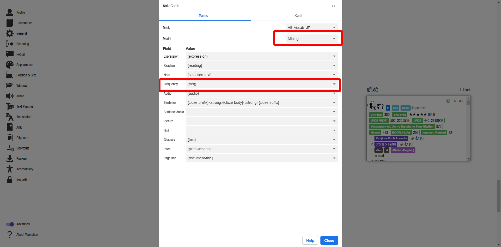

# JP Resources

My contributions to the Japanese learning community. For questions and support, I can be contacted @Marv [in this community](https://learnjapanese.moe/join/).

## Sorting mined Anki cards by frequency

When reading and adding cards from the content you're reading, you'll come across a variety of words with varying degrees of usefulness. Especially as a beginner, you'll want to learn the useful words as soon as possible and learn the less useful words later. With this we can sort a backlog of mined cards by frequency using various installed Yomichan frequency lists.

This handlebar for Yomichan will add a `{freq}` field that will send the first frequency value available to Anki in a numerical format. 

- First, in your Anki card template create a new field for frequency, we can name this `Frequency` or whatever you like.


- Then in Yomichan options, insert the following handlebar code at the end of the menu in `Configure Anki card templates...`.


```handlebars
{{#*inline "freq"}}
    {{~#if (op ">" definition.frequencies.length 0)~}}
        {{#regexReplace "[^\d]" ""}}
            {{definition.frequencies.[0].frequency}}
        {{/regexReplace}}
    {{~/if~}}
{{/inline}}
```

(This only selects the first frequency list value, if you know a method of selecting the lowest frequency value using handlebars please let me know.)

- In `Configure Anki card format...`, we may need to refresh the card model for the new field to show up. To do this, change the model to something else and change it back. This will clear your fields so take a screenshot to remember what you had. When your frequency field shows up, add `{freq}` in its value box to use the handlebar.


### Usage

To sort our new cards by frequency, we need the Anki [Advanced Browser](https://ankiweb.net/shared/info/874215009) addon. Then in your card browser, search for new cards in your mining deck and right click the menu to display your frequency field as shown.
_2022-07-10_10-22-41.png)

Now we can simply sort our new cards by our frequency field, then press `ctrl + a` to select all and then `ctrl + shift + s` to reorder them all. 

- I personally then select the first thirty or so cards and randomly sort them again using the random sort option for more variability when reviewing.

Alternatively you could use the [AnkiAutoReorder](https://github.com/KamWithK/AnkiAutoReorder) addon. I have not personally tried it though.

#### Frequency order

As mentioned, this only takes the first available frequency value from your frequency lists, so your list order matters. Order them by how important they are to you, and also by what has the lowest values first. I primarily read VNs, so my list order looks like this:


### Backfilling old cards

If you already have a large backlog of old cards without frequency values, you might need to fill in these values first or they won't be sorted. You could just opt to finish reviewing these cards first, but there is a hacky method to backfill these cards. But **backup your collection before attempting this, it could cause significant lag to your Anki.**

- Create a frequency list in `.txt` format that contains a list of expressions followed by frequency values. You can use the ones I have created in [frequency](frequency), I recommend downloading the [JPDB](frequency%5CJPDB.txt) list as it's the most exhaustive. 

- In Anki, go to File -> Import, then select the txt frequency file. Map the first field to your term/expression field, then the second field to your frequency field. **Make sure to enable "Update existing notes when first field matches."**


- This will update your existing notes' frequency values, but it'll also import a LOT of new cards. To delete these new cards, search `added:1 Glossary:` in your card browser. The `added:1` is to find cards added today, and `Glossary:` (change it depending on your field name) is to find cards that have no glossary, as all your existing cards should have it. 

- Then hit `ctrl + a` to select all and `ctrl + del` to delete these new cards. But **be sure** you aren't deleting any valid cards first.